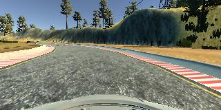
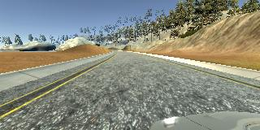
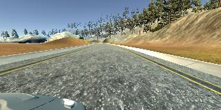

# **Behavioral Cloning** 


**Behavioral Cloning Project**

The goals / steps of this project are the following:
* Use the simulator to collect data of good driving behavior
* Build, a convolution neural network in Keras that predicts steering angles from images
* Train and validate the model with a training and validation set
* Test that the model successfully drives around track one without leaving the road
* Summarize the results with a written report


My project includes the following files:
* model.py containing the script to create and train the model
* drive.py for driving the car in autonomous mode
* model.h5 containing a trained convolution neural network 
* writeup_report.md or writeup_report.pdf summarizing the results


Using the Udacity provided simulator and my drive.py file, the car can be driven autonomously around the track by executing 
```sh
python drive.py model.h5
```


The model.py file contains the code for training and saving the convolution neural network. The file shows the pipeline I used for training and validating the model, and it contains comments to explain how the code works.

### Model Architecture and Training Strategy

#### 1. An appropriate model architecture has been employed

My model consists of a convolution neural network with 3x3 filter sizes and depths between 32 and 128 (model.py lines 74-88) 

The model includes RELU layers to introduce nonlinearity (code lines 78-82), and the data is normalized in the model using a Keras lambda layer (code line 74). 

#### 2. Attempts to reduce overfitting in the model

The model contains dropout layers in order to reduce overfitting (model.py line 83). 

The model was trained and validated on different data sets to ensure that the model was not overfitting (model.py line 17, 65, 66). The model was tested by running it through the simulator and ensuring that the vehicle could stay on the track.

#### 3. Model parameter tuning

The model used an adam optimizer, so the learning rate was not tuned manually (model.py line 90).

#### 4. Appropriate training data

Training data was chosen to keep the vehicle driving on the road. I used a combination of center lane driving, recovering from the left and right sides of the road.

For details about how I created the training data, see the next section. 

### Model Architecture and Training Strategy

#### 1. Solution Design Approach

My first step was to use a convolution neural network model similar to the architecture published by NVIDIA. I think too many filters probably lead model to be overfitting. So I changed layer which has 1164 neurons to 640 neurons. I also converted images from BGR to YUV, but it didn't bring much improvement to the performance. Additionally, I added flipped images and images recorded by right and left cameras to get more data.

There were a few spots where the vehicle fell off the track, especially the turn lakeside. It seems the steer cannot be turned in time, so the car was drove into the lake. In order to improve the driving behavior in this case, I drove the vehicle to close to the inner lane to collect more data around the turn area. Eventually, the trained model on final data worked well.

#### 2. Final Model Architecture

The final model architecture (model.py lines 74-88) consisted of a convolution neural network with the following layers and layer sizes 

| Layer         		|     Description								| 
|:---------------------:|:---------------------------------------------:| 
| Input         		| 160x320x3 YUV image   						| 
| lambda    			| x/255.0-0.5              						|
| Cropping				|(75,20),(0,0)									|
| Convolution 5x5   	| 24,5,5, subsample = (2,2), activation="relu" 	|
| Convolution 5x5   	| 36,5,5, subsample = (2,2), activation="relu" 	|
| Convolution 5x5		|subsample = (2,2), activation="relu"			|
| Convolution 3x3   	| 64,3,3, activation="relu" 					|
| Convolution 3x3		| 64,3,3, activation="relu" 					|
| dropout				| Keep probability 0.8							|
| flatten()				| 												|
| Fully connected		| outputs 640									|
| Fully connected		| outputs 100  									|
| Fully connected		| outputs 50  									|
| Fully connected		| outputs 1										|


#### 3. Creation of the Training Set & Training Process

To capture good driving behavior, I first recorded two laps on track one using center lane driving. Here is an example image of center lane driving:



I then added images recorded by right and left cameras. So the vehicle will learn how to control the steer in different positions which is further off the center line.







To augment the data set, I also flipped images and angles thinking that this would generate more different data to learn.
For example, here is an image that has then been flipped:

![alt text][image6]


I finally randomly shuffled the data set and put 20% of the data into a validation set. 

I used this training data for training the model. The validation set helped determine if the model was over or under fitting. 
The ideal number of epochs was 3 because I tried 10 epochs and 5 epochs, the mean squared error loss on validation data set became worse and the model was overfitting. For the batch size, I set it to 8. I used flipped images and images recorded by right and left cameras. Although the generator only read 8 lines from .csv file every time, it actually generates 48 images to feed to the model. The model I trained runs well, it drives around track without leaving the road. However, my model is still unstable, sometimes it cannot be trained well, even if using the same parameters and the same architecture. Another place I need to improve is that the speed of autonomous vehicle controlled by my model is always between 8 mph and 11 mph. I tried to change architecture and parameters, it didn’t work. 
